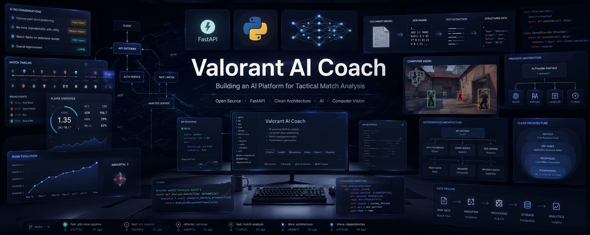

# ValorantAICoach
Open-source AI-powered Valorant analytics platform with automated match collection, player profiling, team insights, and coaching recommendations.

## AI Coach Chatbot

The Streamlit frontend includes the **Valorant AI Coach Assistant**, a conversational coaching feature powered by Google AI Studio (Gemini). It is available from the **AI Coach** entry in the sidebar.

The assistant is configured through a professional system prompt that tunes it as a competitive analyst for the Silver to Platinum ranks, covering agents, roles, maps, economy, positioning, trading, entry, communication and individual improvement. It deliberately avoids VCT-level theory that players at those ranks cannot execute, and it never invents statistics: until the Tracker integration is wired into the chat, the coach states that it has no live player data rather than hallucinating ranks or K/D values.

The feature is fully additive. When `GEMINI_API_KEY` is not configured, the AI Coach page shows the notice *"Configura GEMINI_API_KEY para activar el coach."* and every other page keeps working unchanged.

See [`docs/chatbot_installation.md`](docs/chatbot_installation.md) for the full setup guide, and [`docs/chatbot_delivery.md`](docs/chatbot_delivery.md) for the design rationale and architecture.

### Architecture

```
User
  ↓
Streamlit Chat            pages/6_AI_Coach.py
  ↓
Gemini Client             utils/gemini_client.py
  ↓
Valorant AI Knowledge     utils/coach_persona.py
  ↓
FastAPI / Tracker API     (prepared, not connected)
```

The fourth layer is designed but intentionally inactive. `build_system_prompt()` accepts an optional `player_context`, and `gemini_client.py` ships `format_player_context()` and `fetch_player_context()`. Connecting the chat to live statistics later only requires implementing the body of `fetch_player_context()`; neither the page nor the client logic needs to change.

The integration uses the official **`google-genai`** SDK. The older `google-generativeai` package was deprecated on 30 November 2025 and should not be used.

## Streamlit Cloud Deployment

This project is prepared for deployment on [Streamlit Community Cloud](https://streamlit.io/cloud). Only the Streamlit frontend is deployed there; the FastAPI backend is hosted separately and consumed over HTTP.

### Deployment Configuration

| Setting | Value |
| --- | --- |
| Repository | `Siname22/ValorantAICoach` (or your fork) |
| Branch | `develop` (or your current working branch) |
| Main file path | `frontend/streamlit_app/app.py` |
| Python version | `3.12` |
| Dependencies file | `frontend/streamlit_app/requirements.txt` |

Streamlit Community Cloud installs dependencies from the **first** dependency file it finds, searching the entrypoint directory before the repository root. Within each location the priority is `uv.lock`, `Pipfile`, `environment.yml`, `requirements.txt`, `pyproject.toml`.

Because this repository tracks a `uv.lock` at the root, that lockfile would otherwise win and install only the backend dependencies declared in `pyproject.toml`, leaving `plotly` missing at runtime. For that reason the authoritative deployment requirements file lives **next to the entrypoint**, at `frontend/streamlit_app/requirements.txt`, where it takes precedence over the root lockfile. The root `requirements.txt` is kept only as a convenience for local frontend-only installs and must stay in sync.

### Installation

Local frontend-only setup:

```bash
# From the repository root
python -m venv .venv
source .venv/bin/activate      # Windows: .venv\Scripts\activate
pip install -r requirements.txt
```

Full project setup managed with `uv`:

```bash
uv sync
```

### Secrets Configuration

The frontend needs the base URL of the running FastAPI backend and, for the AI Coach chatbot, a Google AI Studio API key. No backend provider keys (Riot, Tracker) are ever exposed to the Streamlit layer.

| Key | Required | Default | Purpose |
| --- | --- | --- | --- |
| `VALORANT_API_BASE_URL` | No | `http://127.0.0.1:8000` | FastAPI backend consumed by the data pages |
| `GEMINI_API_KEY` | For AI Coach | — | Google AI Studio credential, created at [aistudio.google.com/apikey](https://aistudio.google.com/apikey) |
| `GEMINI_MODEL` | No | `gemini-2.5-flash` | First Gemini model tried by the assistant |

The legacy name `GOOGLE_API_KEY` is still accepted as a fallback so existing deployments keep working, but `GEMINI_API_KEY` is the documented name.

The assistant does not depend on a single model. When the configured model reports itself as saturated or rate limited, the client retries with incremental backoff and then falls back automatically along the chain `gemini-2.5-flash` → `gemini-2.5-flash-lite` → `gemini-3.5-flash`. Setting `GEMINI_MODEL` replaces the first position while keeping every fallback, so the model can be changed from the secrets panel without a code change. See [docs/chatbot_installation.md](docs/chatbot_installation.md) for details.

Local development: copy the template and fill in your value.

```bash
cp .streamlit/secrets.toml.example .streamlit/secrets.toml
```

```toml
# .streamlit/secrets.toml
VALORANT_API_BASE_URL = "http://127.0.0.1:8000"
GEMINI_API_KEY = "your_key_here"
GEMINI_MODEL = "gemini-2.5-flash"
```

Streamlit Community Cloud: open the app dashboard, go to **Settings → Secrets** and paste:

```toml
VALORANT_API_BASE_URL = "https://your-backend-domain.example.com"
GEMINI_API_KEY = "your_key_here"
GEMINI_MODEL = "gemini-2.5-flash"
```

The resolution order implemented in `frontend/streamlit_app/utils/config.py` is Streamlit secrets, then the corresponding environment variable, then the local default. The same order applies to the Gemini credential in `frontend/streamlit_app/utils/gemini_client.py`, which never hardcodes the key. The file `.streamlit/secrets.toml` is git-ignored; only the `.example` template is versioned.

### Local Execution

```bash
# From the repository root
streamlit run frontend/streamlit_app/app.py
```

The app is served at `http://localhost:8501`. To exercise live player data, run the FastAPI backend in parallel:

```bash
uvicorn backend.main:app --reload --port 8000
```

### Deployment Steps

1. Push the branch containing the frontend to GitHub.
2. Sign in to [share.streamlit.io](https://share.streamlit.io) with the GitHub account owning the repository.
3. Select **Create app → Deploy a public app from GitHub**.
4. Fill in repository, branch and the main file path `frontend/streamlit_app/app.py`.
5. Under **Advanced settings**, select Python `3.12` and paste the secrets shown above.
6. Click **Deploy** and monitor the build log until the app boots.
# 🎯 Valorant AI Coach



> AI-powered coaching platform for VALORANT players built with Clean Architecture, FastAPI and multiple data providers.


---

## 🚀 Overview

Valorant AI Coach is an open-source platform that aims to become an intelligent assistant capable of analysing VALORANT matches and helping players improve using Artificial Intelligence.

Unlike traditional stat trackers, this project combines multiple technologies into a single architecture:

- 🎮 Match statistics
- 🤖 Generative AI
- 👁️ Computer Vision
- 📷 OCR
- 📊 Tactical analysis
- 🧠 Personalized coaching

The current focus is building a scalable architecture before implementing advanced AI features.

---

# ✨ Current Features

## Multi Provider SDK

Supports multiple providers through a common abstraction layer.

Current providers:

- Riot API
- HenrikDev API
- Tracker.gg

Future providers can be added without changing business logic.

---

## Player Service

Unified service responsible for obtaining player information.

Features:

- Automatic provider fallback
- Dependency Injection
- Provider abstraction
- Unified domain models

```
Tracker
   ↓
Henrik
   ↓
 Riot
```

If one provider fails, the next one is automatically used.

---

## REST API

FastAPI endpoints already implemented.

Examples:

```
GET /players/{gameName}/{tagLine}

GET /players/{gameName}/{tagLine}/rank

GET /players/{gameName}/{tagLine}/matches
```

---

## Architecture

```
                FastAPI
                   │
           REST Controllers
                   │
            Player Service
                   │
      ┌────────────┼────────────┐
      │            │            │
   Tracker      Henrik        Riot
      │            │            │
      └──────── Providers ──────┘
```

The project follows:

- Clean Architecture
- SOLID principles
- Dependency Injection
- Provider Pattern
- Repository-like abstraction
- Service Layer

---

# 🧪 Quality

Current automated tests:

- Provider SDK
- Riot Provider
- Henrik Provider
- Tracker Provider
- PlayerService
- Agent Framework
- REST endpoints

```
78 tests passing
```

Code quality:

- Ruff
- Black
- Pytest

---

# 📂 Project Structure

```
backend/
    app/
        routers/
        services/
        dependencies/

    providers/
        riot/
        tracker/
        henrik/

agents/

tests/

docs/
```

---

# 🔮 Roadmap

Current progress

- ✅ Provider SDK
- ✅ Tracker Provider
- ✅ Riot Provider
- ✅ Henrik Provider
- ✅ Player Service
- ✅ FastAPI REST API

Next milestones

- OCR integration
- Screenshot analysis
- Computer Vision
- Match timeline analysis
- AI tactical reports
- LLM coaching
- Agent memory
- Web frontend
- Authentication

---

# 🛠️ Tech Stack

Backend

- Python
- FastAPI
- Pydantic
- Pytest

Architecture

- Clean Architecture
- SOLID
- Dependency Injection

External APIs

- Riot Games API
- HenrikDev API
- Tracker.gg

Future AI

- OpenAI
- Gemini
- Claude
- Local LLMs

---

# 🤝 Contributing

Contributions, ideas and feedback are always welcome.

If you'd like to contribute:

1. Fork the repository
2. Create a feature branch
3. Open a Pull Request

---

# ⭐ Why this project?

This project is not intended to become "another VALORANT stats tracker".

Its goal is to explore how modern backend architecture can be combined with Artificial Intelligence to build an intelligent coaching platform capable of understanding gameplay and helping players improve.

---

## 📌 Repository

https://github.com/Siname22/ValorantAICoach
