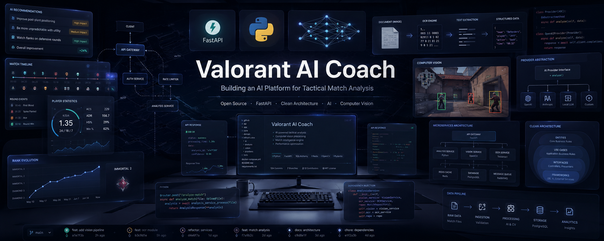

# Valorant AI Coach



AI-powered VALORANT player analytics and coaching, with FastAPI, real data
providers and a Streamlit frontend with a Gemini assistant.

## Development Status

Current branch: `feature/player-intelligence-and-coach`.
Backend version: 0.4.0.

The integration is published in draft [PR #8](https://github.com/Siname22/ValorantAICoach/pull/8)
and continued in branch `feature/player-intelligence-and-coach`.
Remote Python 3.12/3.13, PostgreSQL 16 and container checks passed for source
head `16146ab` in [CI run 37436302896](https://github.com/Siname22/ValorantAICoach/actions/runs/37436302896).
CI reproduced the startup connection reset and recovered with bounded retries,
then verified liveness 200 and the no-provider 503. The real-curl regression
tests also passed on Linux with no skips. The PR shows checks for subsequent
updates. Passing CI is not a production-release claim.

The backend foundation was verified before the current integration: player
identity, rank/history fallback, Riot match detail, explicit provider failures,
and application-scoped HTTP client cleanup. The current branch also incorporates
the Streamlit/Gemini work from `develop`, active player context injection into the AI
coach, map and agent name resolution via `ValorantContentCatalog`, and the
quantitative `MatchAnalystAgent`.

**Development integration, not a production release.** Backend and frontend
verification on October 6 after the approved update: 506 pytest tests passed,
no skips. There was 1 dependency warning (Starlette's test client deprecation;
Alembic's legacy path-separator configuration is resolved with path_separator = os).
The separate Gemini resilience script passed
81 checks; imports, Ruff and Black passed across 120 Python files. Sixteen
PostgreSQL target-guard tests passed locally without connecting to a database.
The PostgreSQL CI suite separately passed 19 tests (16 guards and three real
database tests), with no skips. These are not part of the 506 local test count.
Live provider credentials and public
deployment have not been verified. See [roadmap](docs/ROADMAP.md) and
[delivery plan](docs/DELIVERY_PLAN.md) for the complete remaining scope.

## Local Setup

Python 3.12+ and [uv](https://docs.astral.sh/uv/) are required. From the repository root:

```powershell
uv sync --frozen --extra frontend
Copy-Item .env.example .env
uv run --frozen --extra frontend uvicorn backend.main:app --host 127.0.0.1 --port 8000 --reload
```

For the frontend, use a second terminal:

```powershell
uv run --frozen --extra frontend streamlit run frontend/streamlit_app/app.py
```

Open [Streamlit](http://localhost:8501) or [API documentation](http://127.0.0.1:8000/docs).
Frontend dependencies are an optional extra; backend-only installs remain small.

The backend reads `.env`; Streamlit reads process environment or
`.streamlit/secrets.toml`, not the backend's dotenv file. Copy
`.streamlit/secrets.toml.example` for frontend settings.
Do not commit secrets or share API keys in issues, PRs or chat.

## Providers and Data Semantics

Set one or more backend keys: `HENRIK_API_KEY`,
`TRACKER_API_KEY`, `RIOT_API_KEY`.
A blank key or `<PROVIDER>_ENABLED=false` disables that provider.
Restart the backend after configuration changes.

- Henrik: account identity, current rank/RR and stored match summaries. Account
  region is resolved automatically, or history accepts `?region=eu`.
  Stored history may be incomplete.
- Tracker: profiles, lifetime stats, rank and recent matches, subject to API access.
- Riot: real account-v1 and VAL match API calls. The official API does not expose
  current player rank/RR. Key permissions and the selected shard matter.

The example targets Europe. `RIOT_REGION` derives the shard host only when
`RIOT_BASE_URL` is unset. If using the explicit URL in the example/Compose,
change that URL as well when selecting another shard. Continental account routing
uses the independent `RIOT_ACCOUNT_BASE_URL`.

Match summaries include provider provenance. Riot map asset paths
(e.g. `/Game/Maps/Ascent/Ascent`) and character UUIDs (e.g. `add6443a-41bd-e414-f6ad-e58d267f4e95`)
are resolved to canonical display names and roles (`Ascent`, `Jett - Duelist`) via the
built-in `ValorantContentCatalog`. Timestamps retain provider formats. Henrik's raw
`stats.score` has no documented total/average meaning: the normalized
`score` is null and the original is retained in `provider_score`.
See the [stored-match contract](https://docs.henrikdev.xyz/valorant/guides/stored-matches.md)
and [OpenAPI schema](https://api.henrikdev.xyz/openapi.json).

## API

```text
GET /players/{game}/{tag}
GET /players/{game}/{tag}/rank
GET /players/{game}/{tag}/matches?region=eu&limit=5
GET /players/{game}/{tag}/stats
GET /players/{game}/{tag}/overview?limit=5
GET /matches/{matchId}
GET /health
GET /health/live
```

History limits are 1-20, default 10. Full match detail requires Riot.
`404` means all applicable providers confirmed absence; `503` means
unavailable/disabled capability; `502` means malformed upstream data.
A valid empty history returns 200 with an empty list. Invalid input returns 422.

Lifetime statistics require Tracker and reject invalid counters/non-finite
values rather than truncating or fabricating data. The overview preserves identity when
optional sections fail and distinguishes unavailable history from confirmed
empty history.

Streamlit opens on player lookup. Search results survive reruns without repeated
requests; rank/history outages preserve available data. Displayed provider text
is escaped and RR zero remains visible. Roadmap screens use explicit milestones,
not invented completion percentages.

## Persistence

The owner approved PostgreSQL production storage and isolated SQLite tests on
October 6, 2026. SQLAlchemy models and revision `20261006_01` now cover players,
provider snapshots, matches, per-player history and a future report schema.
The report table is not a report generator, ownership policy or history UI.

Storage is opt-in: `DATABASE_ENABLED=false` preserves provider-only operation
without opening a database connection. For a new development database, set the
backend's private `DATABASE_URL` to PostgreSQL, then migrate explicitly:

```powershell
uv run --frozen alembic upgrade head
```

Only after that succeeds, set `DATABASE_ENABLED=true` and restart FastAPI.
For Compose, run `docker compose up -d postgres`, then
`docker compose run --rm --no-deps backend uv run --no-sync alembic upgrade head`
before enabling storage and starting the backend. Back up existing databases and
review generated SQL before production migrations. Startup never creates tables
or applies migrations; missing/incompatible tables fail startup with a generic
storage error. SQLite activation requires `APP_ENV=test` and is not supported
for production.

Successful profile/rank/stat/history/detail reads persist for
`DATABASE_CACHE_TTL_SECONDS` (default 300, allowed 1-86400). Cache keys distinguish
operation, Riot ID, PUUID, region and history limit. Expired or structurally invalid
data is refreshed; upstream errors are not cached. A confirmed-empty history
retains its actual provider. Database failures return sanitized 503 errors.
Observation/expiry times are UTC; stored match start times normalize only known
timezone-aware dates or millisecond timestamps, retaining the original value.
Public REST schemas and provider timestamp formats remain unchanged.

Real temporary SQLite migrations, schema/model parity, restart retention,
TTL/corruption refresh, concurrent misses, isolation and transactional failures
are tested. A separate PostgreSQL CI job tests real migration round trips,
restart retention and player/provider upserts against disposable test databases;
it passed for published source revision `16146ab`. Simultaneous PostgreSQL
transactions have not been directly exercised; deterministic write ordering is
covered by SQL traces. No production database has been migrated.
Percent-encoded URLs retain their eight Alembic
configuration regressions.

Expired rows are not yet pruned automatically. TTL limits freshness, not database
retention or cross-process request rates; retention, authentication, quotas and
provider-configuration cache invalidation remain release work.

## Gemini Coach

The existing assistant uses the official `google-genai` SDK.
Configure `GEMINI_API_KEY` in Streamlit secrets or environment;
`GEMINI_MODEL` selects the preferred model. No key means the coach is disabled.
The current chat is personalized coaching: when an active player has been looked up
in the dashboard, their identity, rank, and recent match metrics are automatically
injected into the assistant's system prompt. Persistent memory and scheduled background
reports remain separate delivery milestones.
SDK transport phases have 10-second timeouts. The wrapper controls retries
without multiplying the SDK's own attempts, handles actual HTTPX transport
failures, closes the client after each turn, and sanitizes logs and errors.
This is not a total wall-clock deadline. See the
[SDK documentation](https://github.com/googleapis/python-genai) and
[HTTPX exception hierarchy](https://www.python-httpx.org/exceptions/).

Input is capped at 4000 characters in both the widget and client. Retained chat
content is bounded to 20 complete exchanges and 128 KiB of UTF-8 text, including
the greeting/pending turn; old pairs are removed together. These bounds do not
enforce per-user billing quotas. Profile avatars accept validated external HTTPS
URLs, not local paths, data URLs, credentials or control characters; this does
not resolve DNS or certify redirect targets. Devcontainer startup explicitly
enables CORS/XSRF and uses Python 3.12. Riot `Retry-After` waits are capped at
30 seconds per retry, not a total request deadline.

For frontend-only Streamlit Cloud installs, the entrypoint is
`frontend/streamlit_app/app.py` and its adjacent
`requirements.txt` supplies the frontend dependencies. Host FastAPI separately
and set `VALORANT_API_BASE_URL` to that backend.
See [chat setup](docs/chatbot_installation.md).

## Quality and Deployment

```powershell
uv run --frozen --extra frontend pytest -q tests frontend/streamlit_app/tests
uv run --frozen --extra frontend python frontend/streamlit_app/tests/test_gemini_resilience.py
uv run --frozen --extra frontend ruff check .
uv run --frozen --extra frontend black --workers 1 --check backend tests agents frontend database integration_tests
docker compose up --build
```

GitHub CI is configured for locked Python 3.12/3.13 tests, page imports, Gemini
resilience, lint/format checks, and a production container build/liveness smoke test.
An independent PostgreSQL service job runs the explicitly selected
`integration_tests/test_postgres_storage.py`; it fails rather than skips if
`TEST_POSTGRES_URL` is absent. That test URL must identify a test control database
with CREATE DATABASE permission. Tests create/drop only their own UUID-named
databases, never use the operator's `DATABASE_URL` as input, and intercept provider
HTTP. Its configuration follows the [official uv Actions guide](https://docs.astral.sh/uv/guides/integration/github/).
Provider tests simulate HTTP responses and do not prove real key access.
Docker build/runtime has not run locally. Remote CI for source `16146ab` verified the
image build, non-root execution, production imports, startup liveness and the
no-provider 503. Real upstream and hosted deployment smoke tests remain gates. The
liveness command retries startup transport failures while retaining HTTP
failure detection and bounded connect/request/retry waits; a final in-flight
attempt can outlast the retry budget. Local browser checks covered player
lookup and the missing-provider error at 375, 768 and 1280 pixel widths; real
player success and partial results are covered by simulated Streamlit AppTest.
Compose is development configuration with reload, exposed ports and local
database defaults, not a hardened public deployment. Authentication, quota limits
and production readiness must be completed before public access.

## Architecture and Roadmap

[Architecture](docs/Architecture.md) separates implemented components from plans.
The delivery plan retains persistence, measurable analysis, grounded AI reports,
dashboard/history, authentication/linking, background jobs, OCR/screenshots,
evidenced timeline/tactics, persistent agent memory and production deployment.
No milestone is complete solely because scaffolding or a percentage chart exists.

## License and Contributions

Source available for viewing, study and evaluation under the owner's
[proprietary license](LICENSE). This is not an open-source project.

Work on a dedicated branch, maintain this README when creating branches or
pushing changes, and submit a pull request against `main`.
The owner reviews and approves merges; do not commit directly to `main`.

[Repository](https://github.com/Siname22/ValorantAICoach)
